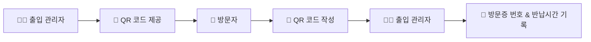

# 📋 일일방문증 관리대장 전자화 건의서

---

## 🔍 문제점 착안

### 현재 상황 분석

사회 복무를 하면서 저에게 할당된 업무는 **학교에 출입하는 방문자들을 대상으로 하는 출입 통제**였습니다.

### 🚨 주요 문제점들

#### 📝 복잡한 수기 작성 과정
- 방문자가 차에서 내려서 직접 손으로 작성해야 하는 정보들:
  - 이름, 전화번호, 생일, 차량번호 등 **다수의 개인정보**

#### 🚗 물리적 제약사항
- **차를 세워둘 공간 부족**
- **출입자 몰림 현상으로 인한 정체**
- **여러 개의 입구로 인한 관리 복잡성**

#### 🔒 보안 및 개인정보 문제
- **방문자가 다른 방문자의 개인정보를 그대로 볼 수 있음**
- **종이 문서로 관리되어 유실 위험이 큼**

#### 📈 통제 강화 요구
- **외부인 침입으로 인한 학생 안전 위협 증가**
- **신임 교장선생님의 통제 강화 방침**
- **기존 문제들이 더욱 확연히 드러남**

---

## 💡 프로젝트 발안

### 🛠️ 해결 방안
**구글 앱스 스크립트**를 활용한 방문증 관리 과정 전자화
- 기재란을 **온라인 설문지**로 전환
- **QR코드 발급**으로 접근성 향상

### ✨ 기대 효과

| 개선 영역 | 기존 문제점 | 개선 효과 |
|:-------:|:----------:|:--------:|
| **🚗 방문자 편의성** | 차에서 내려서 수기 작성 | QR코드 인식 후 모바일 작성 |
| **🔐 개인정보 보호** | 타인의 개인정보 노출 | 개별 작성으로 정보 보호 |
| **📊 관리 효율성** | 수동 타임라인 기록 | 자동화된 기록 관리 |
| **📁 문서 보관** | 종이 문서 유실 위험 | 전자 문서로 안전한 보관 |

---

## 🏗️ 시스템 설계

### 🎯 달성 과제 (3단계)

#### 1️⃣ 설문지 포맷 작성
```
🔧 사용 도구: Google Forms + 앱스 스크립트
📋 내용: 기존 양식을 참고하여 온라인 설문지 제작
```

#### 2️⃣ 데이터 저장소 구축
```
📊 도구: Google Spreadsheet
🔗 연동: 설문지와 스프레드시트 연결
📁 기능: 일일방문증 관리대장 전자 문서화
```

#### 3️⃣ QR 코드 배포 시스템
```
📱 생성: 설문지 및 스프레드시트 링크 QR화
👥 배포: 실무자들에게 QR 코드 제공
```

---

## 🚀 도입 프로세스

### 📋 운영 절차



#### 상세 단계

| 단계 | 담당자 | 행동 | 도구 |
|:---:|:-----:|:----:|:---:|
| **1** | 출입 관리자 | QR 코드 제공 | 📱 모바일/인쇄물 |
| **2** | 방문자 | QR 코드 스캔 및 작성 | 📱 개인 모바일 |
| **3** | 출입 관리자 | 방문증 정보 기록 | 📱 관리자 모바일 |

---

## ⚙️ 실행 요구사항

### 🔑 필수 준비사항

#### 📧 계정 요구사항
- **학교 공용 구글 계정** 또는
- **담당 관리자의 구글 계정**

#### 📚 문서화 작업
- **모든 내용 기록 및 보관**
- **인수인계용 가이드라인 작성**

#### 💻 개발 산출물
- **소스코드 작성 및 관리**
- **README 파일 생성**
- **양식 변경 대응 방안 마련**

### 🛡️ 유지보수 계획

| 항목 | 내용 | 주기 |
|:---:|:----:|:---:|
| **백업** | 데이터 정기 백업 | 주 1회 |
| **점검** | 시스템 동작 확인 | 일 1회 |
| **업데이트** | 양식 및 기능 개선 | 필요시 |

---

## 📈 결론

본 전자화 시스템 도입을 통해 **방문자 관리의 효율성 증대**, **개인정보 보호 강화**, **업무 프로세스 개선**을 달성할 수 있을 것으로 기대됩니다.

> **💡 핵심 가치**  
> 학생 안전 확보 + 방문자 편의성 + 관리 효율성 = **스마트 출입 관리 시스템**
